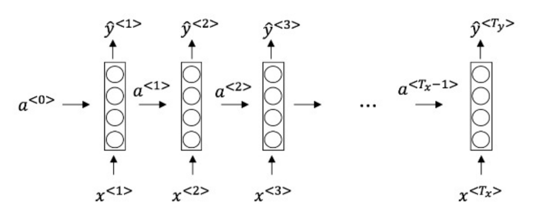

## Week 1 Quiz - Recurrent Neural Networks

1. Suppose your training examples are sentences (sequences of words). Which of the following refers to the $j^{th}$ word in the $i^{th}$ training example?

	- [x] $x^{(i)<j>}$
	> We index into the i-th row first to get the ith training example (represented by parentheses), then the j-th column to get the jth word (represented by the brackets).
	- [ ] $x^{<i>(j)}$
	- [ ] $x^{(j)<i>}$
	- [ ] $x^{<j>(i)}$

2. Consider this RNN: 

This specific type of architecture is appropriate when:

	- [x] $T_x = T_y$
	- [ ] $T_x < T_y$
	- [ ] $T_x > T_y$
	- [ ] $T_x = 1$

3. To which of these tasks would you apply a many-to-one RNN architecture? (Check all that apply).

	- [ ] Speech recognition (input an audio clip and ouput a transcript)
	- [x] Sentiment classification (input a piece of text and output a 0/1 to denote positive or negative sentiment)
	- [ ] Image classification (input an image and output a label)
	- [x] Gender recognition from speech (input an audio clip and output a label indicating the speaker’s gender)

4. You are training this RNN language model.

At the t-th time step, what is the RNN doing? Choose the best answer.
	- [ ] Estimating $P(y^{<1>},y^{<2>}, \dots, y^{<t-1>})$
	- [x] Estimating $P(y^{<t>}∣y^{<1>},y^{<2>},\dots, y^{<t−1>})$
	- [ ] Estimating $P(y^{<t>})$
	- [ ] Estimating $P(y^{<t>}∣y^{<1>},y^{<2>},\dots, y^{<t>})$

5. You have finished training a language model RNN and are using it to sample random sentences, as follows: 

What are you doing at each time step t?
	
	- [ ] (i) Use the probabilities output by the RNN to pick the highest probability word for that time-step as $\hat{y}^{<t>}$. (ii) Then pass the ground truth word from the training set to the next time-step.
	- [ ] (i) Use the probabilities output by the RNN to randomly sample a chosen word for that time-step as $\hat{y}^{<t>}$. (ii) Then pass the ground truth word from the training set to the next time-step.
	- [ ] (i) Use the probabilities output by the RNN to pick the highest probability word for that time-step as $\hat{y}^{<t>}$. (ii) Then pass this selected word to the next time-step.	
	- [x] (i) Use the probabilities output by the RNN to randomly sample a chosen word for that time-step as $\hat{y}^{<t>}$. (ii) Then pass this selected word to the next time-step.

6. You are training an RNN, and find that your weights and activations are all taking on the value of NaN (“Not a Number”). Which of these is the most likely cause of this problem?
	
	- [ ] Vanishing grdient problem.
	- [x] Exploding gradient problem.
	- [ ] ReLU activation function g(.) used to compute g(z), where z is too large.
	- [ ] Sigmoid activation function g(.) used to compute g(z), where z is too large.

7. Suppose you are training a LSTM. You have a 10000 word vocabulary, and are using an LSTM with 100-dimensional activations $a^{<t>}$. What is the dimension of $\Gamma_u$ at each time step?
	- [ ] 1
	- [x] 100
	- [ ] 300
	- [ ] 10000

8. Here’re the update equations for the GRU. 

Alice proposes to simplify the GRU by always removing the $\Gamma{u}$. I.e., setting $\Gamma{u}$ = 1. Betty proposes to simplify the GRU by removing the $\Gamma{r}$. I. e., setting $\Gamma{r}$ = 1 always. Which of these models is more likely to work without vanishing gradient problems even when trained on very long input sequences?

	- [ ] Alice’s model (removing $\Gamma{u}$), because if $\Gamma{r} \approx 0$ for a timestep, the gradient can propagate back through that timestep without much decay.
	- [ ] Alice’s model (removing $\Gamma{u}$), because if $\Gamma{r} \approx 1$ for a timestep, the gradient can propagate back through that timestep without much decay.
	- [x] Betty’s model (removing $\Gamma{r}$), because if $\Gamma{u} \approx 0$ for a timestep, the gradient can propagate back through that timestep without much decay.
	- [ ] Betty’s model (removing $\Gamma{r}$), because if $\Gamma{u} \approx 1$ for a timestep, the gradient can propagate back through that timestep without much decay.

9. Here are the equations for the GRU and the LSTM: 

From these, we can see that the Update Gate and Forget Gate in the LSTM play a role similar to _______ and ______ in the GRU. What should go in the the blanks?

	- [x] $\Gamma{u}$ and $1-\Gamma{u}$
	- [ ] $\Gamma{u}$ and $\Gamma{r}$
	- [ ] $1-\Gamma{u}$ and $\Gamma{u}$
	- [ ] $\Gamma{r}$ and $1-\Gamma{u}$

10. You have a pet dog whose mood is heavily dependent on the current and past few days’ weather. You’ve collected data for the past 365 days on the weather, which you represent as a sequence as $x^{<1>},\dots,x^{<365>}$. You’ve also collected data on your dog’s mood, which you represent as $y^{<1>},\dots,y^{<365>}$. You’d like to build a model to map from x→y. Should you use a Unidirectional RNN or Bidirectional RNN for this problem?

	- [ ] Bidirectional RNN, because this allows the prediction of mood on day t to take into account more information.
	- [ ] Bidirectional RNN, because this allows backpropagation to compute more accurate gradients.
	- [x] Unidirectional RNN, because the value of $y^{<t>}$ depends only on $x^{<1>},…,x^{<t>}$, but not on $x^{<t+1>},…,x^{<365>}$
	- [ ] Unidirectional RNN, because the value of $y^{<t>}$ depends only on $x^{<t>}$, and not other day's weather.	